# Diseño y Arquitectura — WhatsApp Catalog

## 1. Arquitectura de Alto Nivel

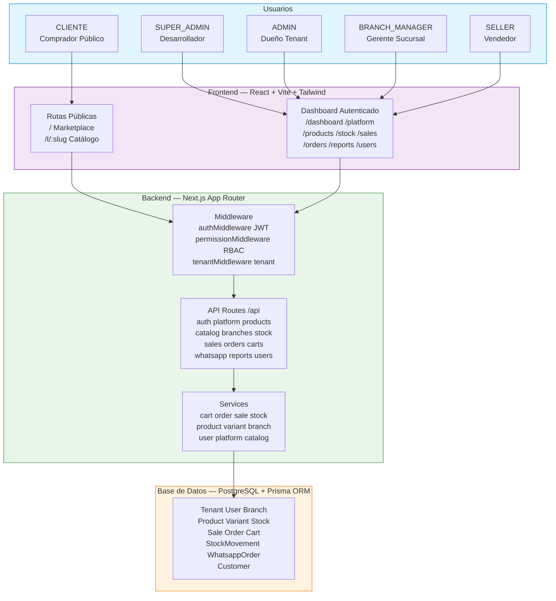

---

## 2. Modelo Multi-Tenant

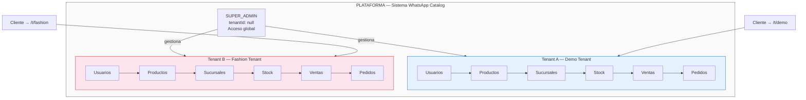

**Reglas de aislamiento:**
- Cada entidad de negocio tiene `tenantId` y relación a `Tenant`
- Todas las queries filtran por `tenantId` automáticamente
- `tenantId` se resuelve desde JWT (rutas autenticadas) o `X-Tenant-ID` (catálogo público)
- SUPER_ADMIN opera sin tenantId — ve datos de todos los tenants

---

## 3. Modelo de Roles y Permisos

### Jerarquía de Roles

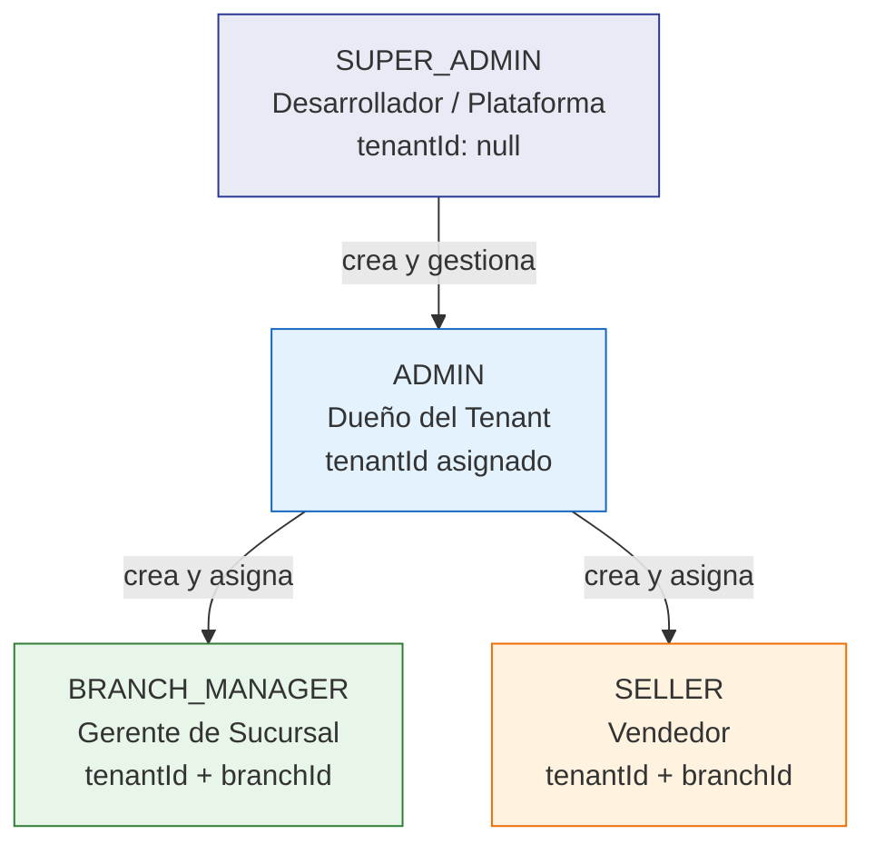

### Matriz de Permisos

| Permiso | SUPER_ADMIN | ADMIN | BRANCH_MANAGER | SELLER |
|---------|:-----------:|:-----:|:--------------:|:------:|
| dashboard | ✓ | ✓ | ✓ | ✓ |
| tenants | ✓ | - | - | - |
| users | ✓ | ✓ | - | - |
| products | ✓ | ✓ | ✓ | - |
| stock | ✓ | ✓ | ✓ | - |
| sales | ✓ | ✓ | ✓ | ✓ |
| reports | ✓ | ✓ | ✓ | - |
| whatsapp_orders | ✓ | ✓ | - | ✓ |

> **Nota:** SUPER_ADMIN tiene todos los permisos pero NO accede a módulos tenant-scoped porque no tiene tenantId.

### Sidebar por Rol

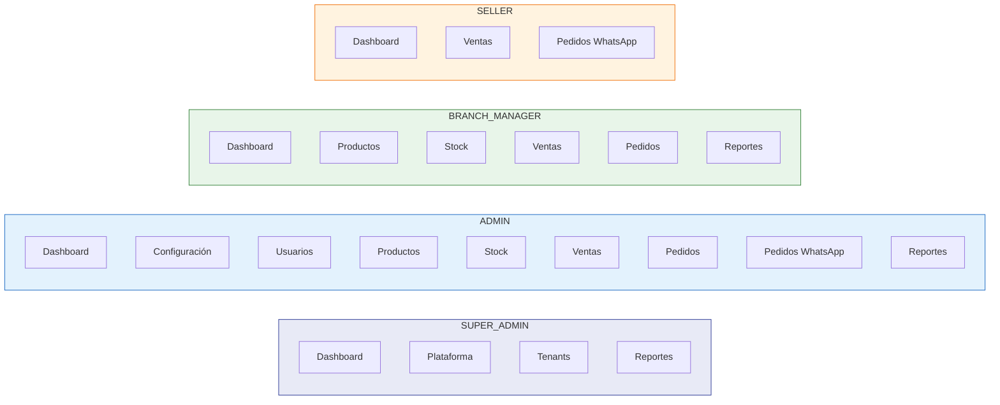

---

## 4. Casos de Uso por Rol

### 4.1 SUPER_ADMIN — Panel de Plataforma

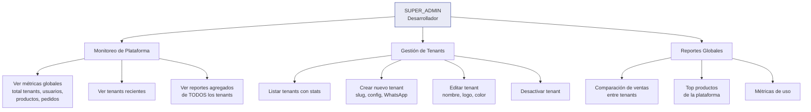

### 4.2 ADMIN — Gestión del Tenant

```mermaid
graph TD
    AD["ADMIN<br/>Dueño del Tenant"]

    AD --> C["Configuración Tienda"]
    AD --> U["Gestión de Usuarios"]
    AD --> I["Gestión de Inventario"]
    AD --> V["Ventas y Pedidos"]
    AD --> RP["Reportes"]

    C --> C1["Editar nombre, logo,<br/>color de la tienda"]
    C --> C2["Configurar WhatsApp"]
    C --> C3["Configurar dominio"]
    C --> C4["Vista previa tienda web"]

    U --> U1["Listar usuarios del tenant"]
    U --> U2["Crear usuario<br/>ADMIN / BRANCH_MGR / SELLER"]
    U --> U3["Asignar sucursal"]
    U --> U4["Activar / desactivar"]

    I --> I1["Crear / editar productos<br/>y variantes"]
    I --> I2["Gestionar stock por sucursal"]
    I --> I3["Ajustar stock"]
    I --> I4["Transferir entre sucursales"]

    V --> V1["Crear ventas manuales"]
    V --> V2["Gestionar pedidos<br/>del carrito público"]
    V --> V3["Procesar pedidos de WhatsApp"]
    V --> V4["Ver historial de ventas"]

    RP --> RP1["Ventas por período y sucursal"]
    RP --> RP2["Top productos"]
    RP --> RP3["Comparación entre sucursales"]

    style AD fill:#e3f2fd,stroke:#1565c0
```

### 4.3 BRANCH_MANAGER — Gestión de Sucursal

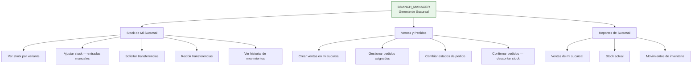

### 4.4 SELLER — Venta y Pedidos

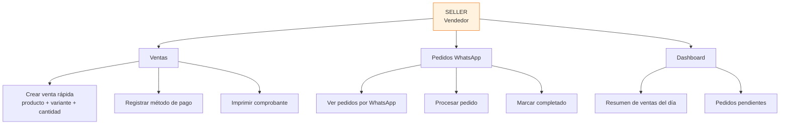

---

## 5. Flujo de la Tienda Web (Catálogo Público)

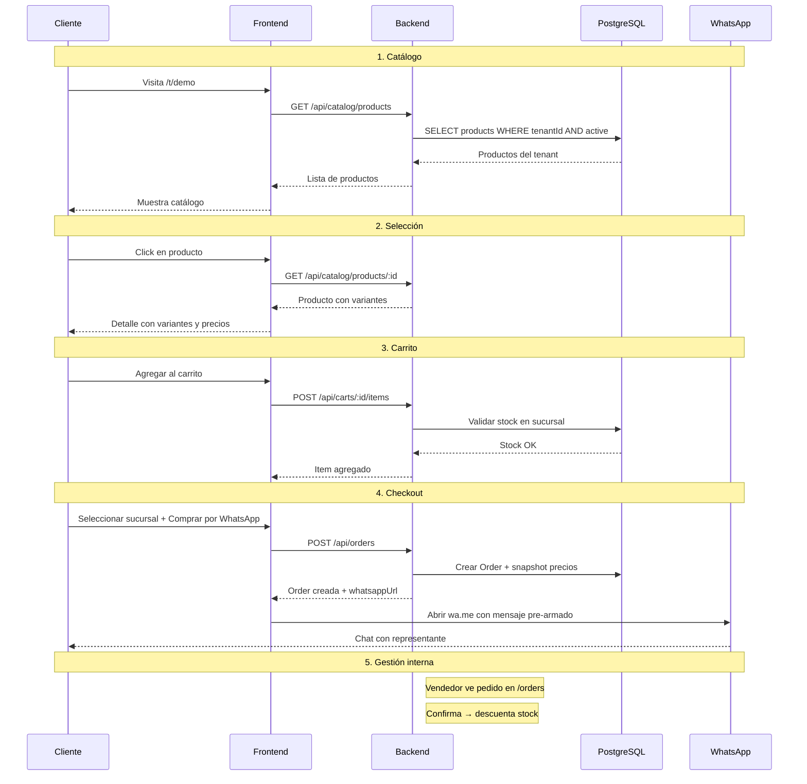

---

## 6. Flujo de Pedidos WhatsApp (Legacy)

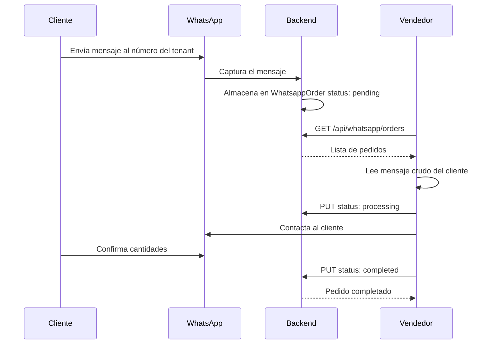

### Diferencia: Orders vs WhatsApp Orders

| Característica | Orders (Nuevo) | WhatsApp Orders (Legacy) |
|---------------|----------------|--------------------------|
| Origen | Carrito web → checkout | Mensaje directo de WhatsApp |
| Estructura | Items, variantes, precios snapshot | Texto crudo del mensaje |
| Stock | Validado y descontado al confirmar | No valida stock automáticamente |
| Trazabilidad | Order → Sale con items detallados | Solo mensaje y total estimado |
| Uso actual | Flujo principal de compra | Compatibilidad con mensajes existentes |

---

## 7. Estructura del Código

```
whatsapp-catalog/
├── backend/
│   ├── prisma/
│   │   ├── schema.prisma          # Modelo de datos
│   │   └── migrations/            # Migraciones versionadas
│   ├── src/
│   │   ├── app/api/               # Route Handlers (App Router)
│   │   │   ├── auth/              # Login, refresh, me, tenants
│   │   │   ├── platform/          # SUPER_ADMIN: tenants, stats
│   │   │   ├── products/          # CRUD productos/variantes
│   │   │   ├── catalog/           # Catálogo público
│   │   │   ├── branches/          # CRUD sucursales
│   │   │   ├── stock/             # Stock, ajustes, transferencias
│   │   │   ├── sales/             # Ventas
│   │   │   ├── orders/            # Pedidos (carrito → WhatsApp)
│   │   │   ├── carts/             # Carrito server-side
│   │   │   ├── whatsapp/          # Pedidos WhatsApp (legacy)
│   │   │   ├── reports/           # Reportes y gráficos
│   │   │   ├── users/             # Gestión de usuarios
│   │   │   └── tenants/           # Configuración de tenant
│   │   ├── modules/               # Lógica de negocio
│   │   │   ├── platform/          # platform.service.ts
│   │   │   ├── users/             # user.service.ts
│   │   │   ├── branches/          # branch.service.ts
│   │   │   ├── stock/             # stock.service.ts
│   │   │   ├── sales/             # sale.service.ts
│   │   │   ├── orders/            # order.service.ts
│   │   │   ├── cart/              # cart.service.ts
│   │   │   ├── whatsapp/          # whatsapp.service.ts
│   │   │   ├── products/          # product.service.ts
│   │   │   ├── variants/          # variant.service.ts
│   │   │   ├── reports/           # report.service.ts
│   │   │   └── catalog/           # catalog.service.ts
│   │   ├── lib/                   # Utilidades compartidas
│   │   │   ├── auth.ts            # JWT, hash, requireTenantId
│   │   │   ├── prisma.ts          # Cliente Prisma
│   │   │   ├── errors.ts          # AppError, handleError
│   │   │   └── permissions.ts     # rolePermissions, hasPermission
│   │   ├── middlewares/           # Middleware de auth/permisos
│   │   │   ├── auth.middleware.ts
│   │   │   ├── permission.middleware.ts
│   │   │   └── tenant.middleware.ts
│   │   └── validators/            # Schemas Zod
│   │       ├── user.schema.ts
│   │       ├── sale.schema.ts
│   │       ├── branch.schema.ts
│   │       └── ...
│   └── tests/                     # Tests Vitest
│
├── frontend/
│   └── src/
│       ├── app/                   # Router y layouts
│       │   ├── router.tsx
│       │   └── routes/web/        # Rutas públicas
│       ├── features/              # Páginas por feature
│       │   ├── auth/              # LoginPage
│       │   ├── dashboard/         # Home, Dashboard
│       │   ├── platform/          # TenantsPage, PlatformDashboard
│       │   ├── products/          # ProductsPage
│       │   ├── stock/             # StockPage
│       │   ├── sales/             # SalesListPage, CreateSalePage
│       │   ├── orders/            # OrdersPage, OrderDetailPage
│       │   ├── whatsapp/          # WhatsAppOrdersPage
│       │   ├── reports/           # ReportsPage
│       │   ├── users/             # UsersPage
│       │   └── settings/          # TenantSettingsPage
│       ├── components/            # Componentes reutilizables
│       │   ├── cart/              # CartDrawer, CartItem, CartSummary
│       │   ├── product/           # ProductCard, ProductActions
│       │   ├── header/            # Header, CartButton
│       │   └── dashboard/         # Layout, Sidebar, ProtectedRoute
│       ├── hooks/                 # Hooks React Query
│       ├── services/              # Clientes API (Axios)
│       ├── store/                 # Zustand (auth, cart)
│       ├── types/                 # Tipos TypeScript
│       ├── config/                # Sidebar, rolePermissions
│       └── lib/                   # Utilidades (whatsapp.ts)
│
├── seed-docker.sql                # Datos de prueba
├── reset-docker.sh                # Reset del entorno Docker
├── development-plan.md            # Plan de desarrollo por slices
├── AUTH_ROLES.md                  # Documentación de autenticación
├── FIXES.md                       # Issues y fixes pendientes
└── DESArN_ARQ.md                  # Este documento
```

---

## 8. Stack Tecnológico

| Capa | Tecnología | Versión |
|------|-----------|---------|
| Frontend | React | 19.2.x |
| Frontend | TypeScript | 5.9.x |
| Frontend | Vite | 7.2.x |
| Frontend | Tailwind CSS | 4.1.x |
| Frontend | React Router | 7.x |
| Frontend | TanStack React Query | 5.x |
| Frontend | Zustand | 5.x |
| Frontend | React Hook Form + Zod | - |
| Frontend | Axios | - |
| Backend | Next.js (App Router) | 16.1.1 |
| Backend | TypeScript | 5.x |
| Backend | Zod | 4.x |
| Backend | JWT (jsonwebtoken) | - |
| Backend | bcryptjs | - |
| ORM | Prisma | 5.22.x |
| DB | PostgreSQL | 16 (Docker) |
| Testing | Vitest (backend) | - |
| Testing | MSW (frontend mocks) | - |

---

## 9. Convenciones de Desarrollo

### Flujo para crear una nueva feature

```mermaid
graph LR
    S1["1. Schema<br/>prisma/schema.prisma"] --> S2["2. Migración<br/>prisma migrate dev"]
    S2 --> S3["3. Service<br/>modules/feat/feat.service.ts"]
    S3 --> S4["4. Validator<br/>validators/feat.schema.ts"]
    S4 --> S5["5. Route<br/>app/api/feat/route.ts"]
    S5 --> S6["6. API Client<br/>services/feat.api.ts"]
    S6 --> S7["7. Hooks<br/>hooks/useFeat.ts"]
    S7 --> S8["8. Page<br/>features/feat/FeatPage.tsx"]
    S8 --> S9["9. Router<br/>router.tsx"]
    S9 --> S10["10. Sidebar<br/>sidebar.config.ts"]
    S10 --> S11["11. Tests<br/>tests/feat.test.ts"]

    style S1 fill:#e8eaf6,stroke:#283593
    style S2 fill:#e8eaf6,stroke:#283593
    style S3 fill:#e3f2fd,stroke:#1565c0
    style S4 fill:#e3f2fd,stroke:#1565c0
    style S5 fill:#e8f5e9,stroke:#388e3c
    style S6 fill:#f3e5f5,stroke:#7b1fa2
    style S7 fill:#f3e5f5,stroke:#7b1fa2
    style S8 fill:#f3e5f5,stroke:#7b1fa2
    style S9 fill:#f3e5f5,stroke:#7b1fa2
    style S10 fill:#f3e5f5,stroke:#7b1fa2
    style S11 fill:#fff3e0,stroke:#f57c00
```

### Contrato de respuesta API

```json
// Éxito:
{ "success": true, "data": T, "meta": { "page": 1, "total": 100 } }

// Error:
{ "success": false, "error": { "code": "VALIDATION_ERROR", "message": "..." } }
```

### Reglas de multitenant

- `tenantId` se resuelve en el servidor desde el JWT
- Nunca enviar `tenantId` desde el frontend en rutas autenticadas
- Todas las queries de negocio incluyen filtro `tenantId`
- SUPER_ADMIN opera sin tenantId (acceso global)
