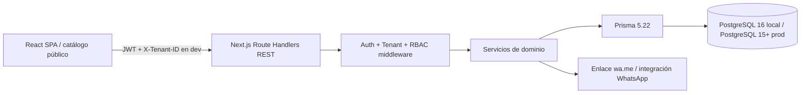

# System Design Document

## 1. Alcance y estado actual

El sistema actual es un dashboard multi-tenant con administración de productos, variantes básicas, stock por sucursal, ventas y gestión de `WhatsappOrder`. El frontend es una SPA Vite/React y el backend es Next.js App Router con Route Handlers REST.

### Estado implementado

- Prisma ya contiene `Tenant`, `Variant`, `tenantId`, sucursales, stock, ventas, refresh tokens y `WhatsappOrder`.
- Existen login, refresh, logout, `/api/auth/me`, productos, sucursales, usuarios, ventas, stock, reportes y pedidos WhatsApp.
- Los servicios principales reciben `tenantId` y varias consultas filtran por ese valor.
- El frontend tiene pantallas de productos, ventas, stock, reportes y pedidos WhatsApp.

### Brechas que este diseño guía

- No existe todavía middleware de resolución por subdominio o `X-Tenant-ID`.
- El RBAC está definido, pero las rutas deben retornar explícitamente la respuesta de `permissionMiddleware`.
- No existen modelos ni rutas de `Cart`, `CartItem`, `Order` u `OrderItem`.
- Las variantes tienen modelo Prisma, pero no tienen CRUD REST independiente ni creación anidada desde producto.
- Las respuestas actuales no usan de forma global el envelope `success/data/error`.

Las secciones siguientes describen la arquitectura objetivo. Las rutas o modelos no listados como implementados deben tratarse como trabajo futuro, no como capacidades disponibles.

## 2. Arquitectura

### Flujo de autenticación y tenant

1. Actualmente, login recibe credenciales y busca al usuario por `tenantId + email`; el origen de ese tenant todavía pertenece al contexto existente, no a un middleware de subdominio.
2. El backend verifica el hash y emite access token JWT y refresh token persistido.
3. Cada request protegida pasa por auth middleware, que extrae `userId`, `tenantId`, `role` y `branchId`. La aplicación de permisos debe completarse retornando el resultado de `permissionMiddleware`.
4. Objetivo futuro: resolver el tenant por sesión, subdominio y, solo en desarrollo/API, `X-Tenant-ID` validado.
5. El servicio debe recibir un contexto inmutable `{ userId, tenantId, role, branchId }` y usarlo en cada operación Prisma. El `tenantId` del request no puede sobrescribirlo.

## 3. Modelo de datos

Todas las entidades tenant-owned tienen `id String @id @default(uuid())`, `tenantId String`, FK a `tenants(id)` e índices tenant-aware.

### `tenants`

**Actual:** `id` y `name`. Un tenant agrupa usuarios, sucursales, catálogo, inventario, ventas, pedidos WhatsApp y refresh tokens.

**Objetivo:** agregar `slug` o `domain` único, `active` y timestamps para resolver el tenant por subdominio y controlar su estado.

### `users`

`id`, `tenant_id`, `name`, `email`, `password`, `role`, `branch_id` opcional, timestamps. `email` es único por tenant. El código actual usa `SUPER_ADMIN`, `BRANCH_MANAGER` y `SELLER`; cualquier renombrado a `admin` y `representante` requiere migración y actualización de permisos.

### `branches`

`id`, `tenant_id`, `name`, `type` (`physical` o `virtual`), `address`, `hours`, timestamps. Una sucursal tiene usuarios, stock y ventas.

### `products`

`id`, `tenant_id`, `name`, `image_url`, `batch`, `expiration_date`, `base_attributes` JSONB, `active`, timestamps. Contiene información compartida por sus variantes; no debe usarse para representar el SKU vendible.

### `variants`

`id`, `tenant_id`, `product_id`, `sku`, `price`, `cost`, `attributes` JSONB, timestamps. `sku` es único por tenant. `attributes` permite `{ "size": "M", "color": "rojo" }` o atributos de construcción/electrónica sin alterar el schema por rubro.

### `stock`

`id`, `tenant_id`, `branch_id`, `variant_id`, `quantity`, timestamps opcionales. Único por `(tenant_id, branch_id, variant_id)`. Una variante puede tener existencias en varias sucursales.

### `carts`

`id`, `tenant_id`, `session_key` o `customer_id` opcional, `branch_id` opcional, `status` (`active`, `submitted`, `abandoned`), timestamps y expiración. Un carrito activo pertenece a un tenant y, al seleccionar sucursal, queda asociado a esa sucursal.

### `cart_items`

`id`, `tenant_id`, `cart_id`, `variant_id`, `quantity`, `unit_price_snapshot`, timestamps. Único por `(tenant_id, cart_id, variant_id)`. El precio snapshot evita que un cambio posterior del catálogo modifique el pedido ya iniciado.

### `orders`

`id`, `tenant_id`, `cart_id`, `branch_id`, `representative_id` opcional, `customer_name`, `customer_phone`, `customer_notes`, `status` (`pending`, `contacted`, `confirmed`, `completed`, `cancelled`), `total_snapshot`, `whatsapp_message`, timestamps. Los items del pedido deben conservar variante, SKU, atributos, cantidad y precio snapshot. `WhatsappOrder` actual puede mantenerse como integración/compatibilidad mientras `orders` se convierte en el agregado comercial principal.

### Relaciones y consistencia

**Actual:** `Tenant 1:N User, Branch, Product, Variant, Stock, Sale, SaleItem, WhatsappOrder, RefreshToken`; `Product 1:N Variant`; `Branch 1:N Stock, Sale`; `Variant 1:N Stock, SaleItem`.

**Objetivo:** agregar `Cart`, `CartItem`, `Order` y `OrderItem`, manteniendo las FKs y servicios que impidan referencias entre tenants. Stock y ventas se modifican dentro de una transacción PostgreSQL y registran movimientos.

## 4. Contrato REST

### Respuesta unificada

Éxito: `{ "success": true, "data": ..., "meta": ... }`.

Error: `{ "success": false, "error": { "code": "CODE", "message": "Mensaje", "details": ... } }`.

### Auth

| Método | Ruta | Propósito |
|---|---|---|
| POST | `/api/auth/login` | Login tenant-aware; devuelve access/refresh token |
| POST | `/api/auth/refresh` | Rota el refresh token y devuelve access token |
| POST | `/api/auth/logout` | Revoca el refresh token |
| GET | `/api/auth/me` | Devuelve usuario, rol, tenant y sucursal |
| POST | `/api/auth/tenants` | Registra tenant y usuario administrador |

### Products y Variants

| Método | Ruta | Propósito |
|---|---|---|
| GET | `/api/products` | Catálogo filtrado por tenant, búsqueda y paginación |
| POST | `/api/products` | Crea producto y variantes, con validación Zod |
| GET | `/api/products/:id` | Detalle con variantes y atributos |
| PUT | `/api/products/:id` | Actualiza producto |
| DELETE | `/api/products/:id` | Desactiva o elimina según política |
| POST | `/api/products/:id/variants` | Crea variante |
| PUT | `/api/variants/:id` | Actualiza SKU, precio y atributos |
| DELETE | `/api/variants/:id` | Desactiva variante sin romper históricos |

### Stock y Branches

| Método | Ruta | Propósito |
|---|---|---|
| GET | `/api/branches` | Lista sucursales del tenant |
| POST | `/api/branches` | Crea sucursal |
| PUT | `/api/branches/:id` | Actualiza sucursal |
| GET | `/api/stock/product/:productId` | Stock de las variantes de un producto |
| GET | `/api/stock/branch` | Stock de una sucursal; el contrato actual recibe el identificador según la implementación de la ruta |
| POST | `/api/stock/adjust` | Ajuste atómico y auditado |
| POST | `/api/stock/transfer` | Transferencia atómica entre sucursales |
| GET | `/api/stock/history` | Historial de stock; el contrato actual no usa segmento dinámico |

### Cart y Orders (objetivo, aún no implementado)

| Método | Ruta | Propósito |
|---|---|---|
| POST | `/api/carts` | Crea o recupera carrito público del tenant |
| GET | `/api/carts/:id` | Obtiene carrito y disponibilidad |
| POST | `/api/carts/:id/items` | Agrega o incrementa una variante |
| PATCH | `/api/carts/:id/items/:itemId` | Cambia cantidad |
| DELETE | `/api/carts/:id/items/:itemId` | Quita un item |
| PATCH | `/api/carts/:id/branch` | Selecciona sucursal y recalcula stock |
| POST | `/api/orders` | Convierte carrito en pedido, calcula representante y mensaje |
| GET | `/api/orders` | Lista pedidos según rol/sucursal |
| GET | `/api/orders/:id` | Detalle del pedido |
| PATCH | `/api/orders/:id/status` | Cambia estado con permiso |

## 5. Lógica crítica de compra

1. **Objetivo:** el cliente abre el catálogo con tenant resuelto y crea un carrito por sesión. Actualmente no existe el carrito persistido.
2. Agregar al carrito valida que producto, variante y tenant coincidan, que el producto esté activo y que la cantidad sea positiva. Se guarda el precio snapshot.
3. El cliente selecciona una sucursal. El backend valida la sucursal del tenant y devuelve disponibilidad por variante; el frontend no decide stock.
4. Al confirmar, una transacción vuelve a verificar stock y calcula el representante asignado: representante activo de la sucursal, con fallback definido por la política del tenant. Nunca se confía en un `representativeId` enviado por el cliente.
5. Se crea el pedido con snapshots de items, total y cliente. Para el flujo WhatsApp se genera un texto determinista con tenant, sucursal, cliente, SKU, atributos, cantidades, precios y total.
6. **Objetivo:** construir `https://wa.me/<phone>?text=<encodeURIComponent(message)>` o delegar a WhatsApp Business API. El flujo actual administra `WhatsappOrder` y puede convertirlo a `Sale`, pero no genera todavía este enlace desde un carrito.
